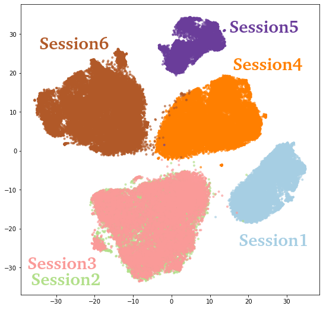

## Neural Computation Laboratory
https://nckunclab.wixsite.com/neuralcomputationlab  
本實驗室研究猴子與大鼠的腦波，以類神經網路為基礎，設計侵入式腦機介面，幫助患者以意念控制外部機器。  

# t-SNE
在腦波的研究中，目的是透過類神經網路從猴腦神經訊號中解碼出手指運動，為了設計適合的類神經網路要先觀察神經訊號的特性，高維度的神經訊號在觀察與解碼的過程需要降維處理，而t-SNE(t-Distributed Stochastic Neighbor Embedding)是一種基於流行學習(manifold learning)的降維技術，適合高維數據集的降維與可視化，可幫助我們觀察神經訊號分佈的。相較於其他常見降維方法如PCA、LLE等，t-SNE計算時間較長，為了縮短耗時，可使用GPU加速運算([tsne-cuda](https://github.com/CannyLab/tsne-cuda))。

# 安裝
test.py中可選擇使用sklearn的t-SNE與tsne-cuda兩種。  
透過conda安裝scikit-learn與tsne-cuda
### sklearn_tsne

    conda install -c anaconda sklearn-learn
### cuda_tsne
tsne-cuda目前僅支持LINUX環境，支持CUDA 9.0、9.2、10.0、10.1。
例：CUDA版本10.1  

    conda install tsnecuda cuda101 -c cannylab
[ tsne-cuda安裝參考](https://github.com/CannyLab/tsne-cuda/wiki)  
### 其他套件

    conda install -c anaconda scipy
    conda install -c conda-forge argparse
    conda install -c conda-forge matplotlib
    conda install -c anaconda numpy
# 執行
### sklearn_tsne

    from sklearn import manifold
    tsne = manifold.TSNE(n_components=2,perplexity=20,learning_rate=500)
    X_tsne = tsne.fit_transform(X)
### cuda_tsne

    from tsnecuda import TSNE
    X_tsne = TSNE(n_components=2, perplexity=20, learning_rate=500).fit_transform(X)
### 範例
    python test.py
經過t-SNE降維後，6個Session各自成群是因為神經訊號會隨著時間變異，而Session2、Session3因為是同一天，所以兩個分佈相似。
  
### Options
--tsne:選擇是否用cuda_tsne，預設sklearn_tsne。  
--session:選擇Session，預設1 ~ 6。  
--sort:選擇是否sorted，預設unsort。  
--perplexity:t-SNE的困惑度(5 ~ 50)，預設30。  
--lr:t-SNE的learning_rate(10 ~ 1000)，預設500。  
例：用cuda_tsne、Session2 ~5、sorted data、perplexity=20、learning_rate=200

    python test.py --tsne cuda_tsne --session 2345 --sort sorted --perplexity 10 --lr 200  
perplexity、learning_rate的設定可參考[How to Use t-SNE Effectively](https://distill.pub/2016/misread-tsne/)  
# Datasets
為Sabes lab公開的恆河猴實驗數據，猴子Indy前6個Session，取spike(500 ~ 5000Hz)再計算Spike counts。
https://zenodo.org/record/3854034#.X4UH_HUzY5l
# 參考資料
http://lvdmaaten.github.io/tsne/  
https://github.com/CannyLab/tsne-cuda  
https://distill.pub/2016/misread-tsne/  

